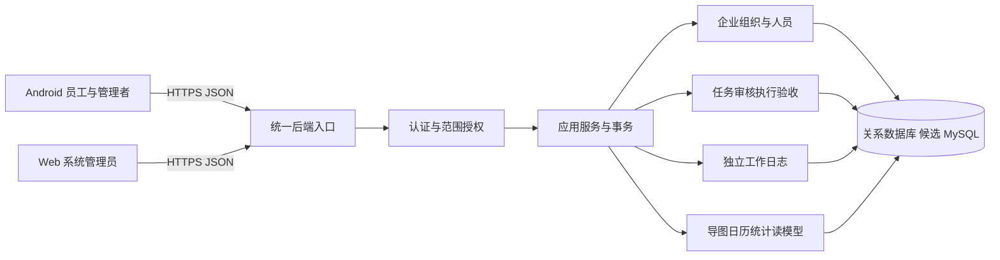
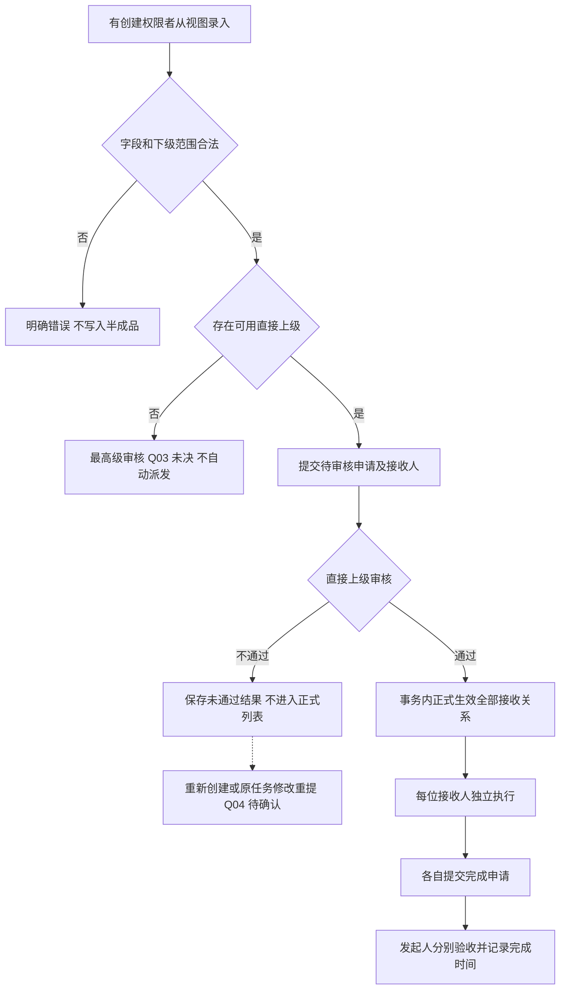
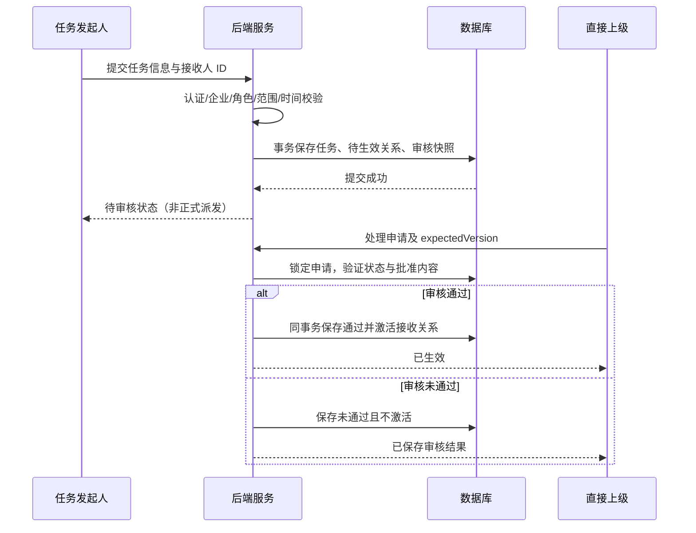
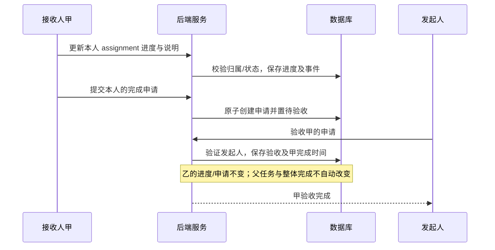

# Pandora 技术架构设计

版本：A0.1 / 2026-10-09。状态：供团队与甲方评审的设计草案，**不是已实现架构**。

需求依据：[第二章 V1.2 草案](../requirements/Pandora_第二章_20261009需求修订草案.md)、[修订说明](../requirements/Pandora_20261009_修改说明与待确认事项.md)、[需求审查记录](../requirements/Pandora_20261009_需求审查记录.md)。数据依据：[数据库草案](../database/Pandora_数据库设计_20261009.md)。本次文档位于 LoFi，不代表正式业务代码已获合并批准。

## 1. 目标、范围与事实边界

### 1.1 目标

构建一个企业内部工作管理系统，支持人员与权限、任务申请审核和多人执行验收、独立工作日志、四类导图信息、日/周/月任务视图及本人基础统计。保证企业隔离、管理范围隔离和关键状态一致性，允许 Android 与 Web 独立开发和构建。

### 1.2 范围

| 范围 | 本轮设计处理 |
| --- | --- |
| P0 | 登录权限、企业/组织/人员、任务审核派发/进度/验收、日志、导图、任务视图、本人基础统计 |
| 存在待确认条款的 P0 | 保留设计分支和决策门：最高级审核、原任务驳回重提、父任务可选关联、周/月日志、时间边界、选择联动 |
| P1 | 提醒、团队统计、工作邀约/请示仅描述扩展边界，不增加运行依赖 |
| P2 | AI 关键词、总结、建议仅留隔离接口方向，不接入模型、不设计 AI 自动派发或审批 |
| 不包含 | MBTI、复杂 OA 审批引擎、思维导图编辑、微服务拆分、真实生产部署或数据库迁移 |

“任务审核入口以后设计”不等于删除审核。没有审核的本地任务保存只属于演示，不可当正式派发。

### 1.3 仓库现状（本次只读核对）

| 模块 | 当前证据 | 已有 / 尚未实现 |
| --- | --- | --- |
| Android | android/app/build.gradle.kts、android/gradle/libs.versions.toml、MainActivity.kt、mock/MockData.kt | Kotlin 2.0.21、Compose BOM 2024.12.01、AGP 8.7.3、Java 21，minSdk 24 / target 35；离线 LoFi。未建立真实登录、服务端权限和持久化业务 |
| Web | web/package.json | React 19.2.8 版本范围、TypeScript 6.0.2、Vite 8.3.0；管理业务待实现。版本范围不是锁定安装版本证明 |
| Backend | backend/pom.xml、application 配置 | Java 21、Spring Boot 4.0.3、Maven、Web MVC/Actuator 基线；没有 Security、JPA/MyBatis、MySQL 驱动、迁移依赖 |
| 数据库 | README.md | MySQL 尚在评估；本设计建议 MySQL 8.4 / InnoDB，未安装、建库或建表 |
| 文档 | docs/requirements 三份来源 | 第二章为最新输入；完整原件第 3 章尚待填充，本次草案独立交付 |

## 2. 关键架构决策

| 编号 | 建议决策 | 理由、替代方案及确认状态 |
| --- | --- | --- |
| AD-01 | 模块化单体后端，按业务能力分包 | 任务、审核与验收需要强事务；当前团队无需承担微服务通信和分布式一致性。技术建议，未新增服务 |
| AD-02 | Android / Web 共用统一后端，业务库只有后端可访问 | 角色、组织、数据归属必须在服务端验证；客户端隐藏按钮不能替代授权。FR-USER-06～08、NFR-SEC-02/03 |
| AD-03 | 用 Spring Security 统一认证和功能授权；单实例 MVP 优先评审服务端可撤销会话方案 | Web 建议 HttpOnly/Secure Cookie 配合 CSRF 防护，Android 建议不透明 Bearer 凭据；二者映射同一身份。令牌、期限、会话存储和撤销策略须技术评审，未安装依赖。JWT 不是当前已确认选择 |
| AD-04 | 角色操作权限与数据范围判断分离 | 统一策略模块处理角色权限，再处理企业、管理组织、参与关系、日志归属；不把某“部门负责人”角色等同企业全部数据权限 |
| AD-05 | MySQL 8.4 / InnoDB + 关系模型 + 事务 | 多接收人、权限、审核和日志选择适合关联约束。数据库选型仍待团队认可；不因本文件改变 README 的“待评估”事实 |
| AD-06 | 数据访问框架暂建议 Spring Data JPA；复杂列表使用投影及明确查询 | 不以 ORM 自动推导所有权限查询，避免 N+1；MyBatis/JDBC 是可评审替代，不同时引入多套。框架与迁移工具后续 change 决定 |
| AD-07 | 审核针对派发申请，执行/验收针对接收关系 | task 保存共享信息，task_assignment 保存各接收人的事实；日历返回本人状态或授权管理视角，不能混用 |
| AD-08 | 不为日周月各建任务表，不把日志当任务 | 视图是同一任务数据的读投影，跨周条形只是客户端分段。FR-VIEW-01/06/07/08 |
| AD-09 | 待确认规则以决策门隔离，不设置“方便演示”的生产默认 | 创始人不自动免审；普通员工没有创建权；长期草稿与日志关联暂缓；原型角色切换不进入正式认证 |

密码仅保存自适应单向哈希，禁止明文或可逆加密；具体编码器与工作因子在固定部署环境测量后确定。此技术选择依据 [Spring Security 密码存储文档](https://docs.spring.io/spring-security/reference/features/authentication/password-storage.html)，不是新增产品规则。

## 3. 系统与模块结构



这是目标依赖图，不是当前部署拓扑；三端仍可用各自基线独立运行。正式业务联调需要后端和数据库，独立构建不代表业务能够离线完成。

### 3.1 后端能力边界

| 模块 | 职责 | 关键规则 | 需求映射 |
| --- | --- | --- | --- |
| identity / organization | 认证、账号、角色分配、组织树和人的直属上级 | 账号归属企业；组织关系无环；管理员后台操作不自动获得日常派发权限 | FR-USER-01～08 |
| authorization | 统一操作权限与数据范围策略 | 可信主体取自服务端；请求的 enterprise_id/owner_id 不能改变身份 | FR-USER-06、FR-TASK-11、FR-LOG-07 |
| task | 创建申请、审核、授权详情、接收关系、进度、完成申请和验收 | 通过审核才正式生效；接收人分开执行，发起人分开验收 | FR-TASK-01～15；16/17 部分待确认 |
| worklog | 新建、本人历史与日期查询、本人编辑、授权上级读取 | 同日多条，不强制关联任务，不提供日志删除；已发布与私人草稿隔离 | FR-LOG-01～08 |
| dashboard | 公司事项、本人相关正式任务、个人选中日志、近十日个人日志 | 候选完整日志，最多十条选择，不使用 AI 摘要；个人日志不硬截十条 | FR-DASH-01～08 |
| calendar | 按范围查询任务并返回时间和接收状态 | 全天/定时，共享任务 ID；月完整、逐级查看；周月日志待定 | FR-VIEW-01～09 |
| statistics | 本人总数/完成/未完成 | 口径 Q-12 确认后实现，验收完成不等于 progress=100 | FR-STAT-01/02 |
| future adapters | 提醒、请示和 AI | P1/P2 经独立变更再实施；不控制 P0 事务提交 | FR-NOTIFY-01、FR-REQUEST-01、FR-AI-01～03 |

后端建议依赖方向：入口 DTO → 应用服务 → 业务规则 / 授权策略 → 数据访问。数据库实体不直接序列化给客户端；跨模块通过明确服务方法/只读投影，不相互绕过规则写库。权限模型包括角色与权限概念，但 P0 不默认增加可任意配置审批流或角色权限编辑器；权限目录集中维护，管理员按已确定角色配置用户。

### 3.2 Android

展示入口为导图、视图、日志、AI 地图、我的。日志只呈现日志业务，任务详情和任务录入从视图进入；审核最终入口留空待 Q-02 确定。AI 地图目前可保留规划占位，不能表述为正式 AI 分析已完成。

建议结构（目标，不强制改包名或立即拆 Gradle 模块）：

```text
app/
  navigation/                 一级目的地、返回栈、详情参数
  ui/dashboard/ calendar/ log/ profile/ ai/
  ui/components/ theme/
  presentation/               ViewModel、UiState、用户事件
  domain/                     需要复用的用例和时间模型
  data/repository/            Task、Log、Dashboard、User 数据入口
  data/mock/ remote/          离线演示与未来接口适配
```

Compose 根据 UiState 展示，ViewModel 处理事件；Repository 提供统一数据源，可切换 mock/remote。只有确实复用的逻辑进入用例层，不为每次按钮点击制造多层包装。参考 [Android 官方架构指南](https://developer.android.com/topic/architecture) 的 UI/数据分层和单向数据流，当前原型并未完成上述全部分层。

页面参数只传 taskId、assignmentId、selectedDate、mode 等，不把旧任务对象当持久真值。返回详情后重新读取权威数据；发布成功后使本人日志、导图候选、近十日列表失效并重查。FR-DASH-07 关于新增后“自动补位/自动选中”未确认，不能把刷新误当选择联动规则。

### 3.3 Web

管理端按 2.5 的系统管理员职责提供账号、组织、上下级和角色配置。不能因前端是管理员后台就默认允许浏览全部私人日志。管理员业务数据访问范围存在待确认条款，策略默认拒绝未授权操作。

React 页面负责表单与展示，客户端接口适配集中管理；不在前端持有 DB 凭据、密码散列、管理者范围 SQL。组织变更提交后服务端验证同企业、环路、引用和管理范围，失败不得半更新。

## 4. 服务端权限设计

### 4.1 判断顺序

每次读写按“已认证且账号可用 → 当前企业 → 当前角色允许操作 → 数据归属/参与关系/管理范围 → 当前状态允许”的顺序判定。企业从可信身份上下文取得，不能仅信任请求字段或客户端缓存的角色。

| 行为 | 允许条件摘要 |
| --- | --- |
| 创建任务 | 当前身份具备创建权；普通员工拒绝；接收人为管理范围内下级，含授权跨级下级 |
| 审核派发 | 当前用户是发起人的直接上级且具审核权，审核申请尚未处理；无上级分支 Q-03 待确认 |
| 读取任务 | 本人是合法参与人或有管理关系，且在同企业；接收人列表不包含尚未生效申请 |
| 更新进度/提交完成 | 操作者是该 assignment 的接收人；正式生效且状态允许；不能更新另一接收人的进度 |
| 完成验收 | 操作者为任务发起人；验收的是指定接收人的完成申请 |
| 编辑日志 | 本人已发布日志，在文档允许范围；管理者只能依授权读取下级日志，不能代改 |
| 选择个人重要事项 | 本人最近十日的已发布完整日志，去重，最多十条；不能选别人的日志 |
| 管理账号组织 | 系统管理员在已授权企业范围内操作，不能以管理员身份替代业务审核人 |

读取管理范围应同时考虑角色层级和被授权组织子树；人员直属上级用于派发审核。两种关系分别建模：不假设“团队所属部门”永远就是团队长本人审核链。人员/组织变更时重新取当前权限；历史审核保存当时审核人，不因组织变化覆盖事实。待审任务遇到上级变更的转交方式须补充决策，先拒绝不匹配处理而非自动转交。

对于关联子任务，不能一律仅用“当前组织下级”查询而漏掉父任务发起人的特定查看权；Q-11 确认后，由关联授权策略验证 parentId、发起/接收关系和同企业范围，逐级返回允许看的子任务，不推导跨企业授权。

### 4.2 安全边界

- TLS 是正式环境传输要求；本地开发与模拟环境分离，不在仓库存储生产凭据。
- 角色权限和数据范围在服务端统一校验；客户端只优化可用入口，不是授权主体。
- 使用输入 DTO 白名单，禁止批量绑定企业、作者、审核人、完成时间等受保护字段。
- 登录和权限错误给可理解提示，错误日志脱敏；凭据、日志正文不作为调试全文输出。
- 登录方式、会话有效期、防暴力限制等属后续安全实施设计，不在本次伪造已完成配置。

## 5. 状态、事务与并发

### 5.1 分层状态

以下英文代码是技术候选，不是新增需求名称：

| 对象 | 候选状态/事实 | 边界 |
| --- | --- | --- |
| task 的派发审核 | PENDING、APPROVED、REJECTED | 未通过不能正式派发；没有默认 DRAFT 或免审状态 |
| task 的整体情况 | OPEN、COMPLETED（负责人明确确认） | 整体完成的触发方式 Q-12 待确认，不能以全员进度相加或子任务状态自动置完成 |
| assignment | PENDING_APPROVAL、ACTIVE、AWAITING_ACCEPTANCE、ACCEPTED | 待审核接收关系不进入正式列表；进度是独立数值，100 不等于 ACCEPTED |
| completion_request | PENDING、ACCEPTED；拒绝后处理分支待确认 | 接收人提交申请与发起人验收分开；未确认再次申请/验收不通过的细则不默认加入 |
| work_log | 已发布正文与记录事实 | 私人未发布草稿独立于正式日志；草稿长期存储 Q-10 待确认 |

REJECTED 表达审核未通过事实，但“修改同一 taskId 后重提”仍是 Q-04 候选。已验收完成不得重新开启；US07 的不可修改字段在服务端执行，不能仅禁用客户端输入。

### 5.2 原子操作

| 操作 | 同一事务内的变更 | 失败处理 |
| --- | --- | --- |
| 提交任务申请 | 校验人员/范围/时间；task、待生效 assignment、task_review 审核快照 | 任一接收人无权限则整个提交失败，不默默部分派发 |
| 审核通过 | 校验直接上级、申请版本；审核结果、task 审核状态、全部本轮 assignment 激活 | 全部成功才可见，避免审核通过但部分接收关系未创建 |
| 审核不通过 | 保存结果；task 为 REJECTED；待生效关系不激活 | 不进入接收人正式日历和列表；重提路径确认后实施 |
| 更新个人进度 | assignment 最新进度 + 进度事件 | 版本冲突返回冲突，不覆盖别人刚写的值 |
| 提交完成 | 创建 completion_request + assignment 进入待验收 | 锁定接收关系，防止同时生成多个待处理申请 |
| 验收通过 | 更新申请结果 + assignment ACCEPTED + 服务端完成时间 | 重复提交不重复验收；不会自动完成父任务 |
| 修改已发布日志 | 校验作者及版本；更新日志正文/更新时间 | 冲突明确提示，重新读取后编辑，不静默覆盖 |
| 替换个人选择 | 锁定该用户 selection_state；校验全部 ID、窗口和数量；整体替换选择集合 | 超过十条或含无权日志全部拒绝；不只保存合法子集 |

应用事务建议用 Spring 声明式事务，但需验证异常回滚和代理调用边界，不能仅加一个注解就声称原子性成立。参见 [Spring 事务注解文档](https://docs.spring.io/spring-framework/reference/data-access/transaction/declarative/annotations.html)。所有外部 AI/通知调用不放进核心数据库事务；P1 提醒若需可靠投递，届时评审 outbox 方案，不现在引入消息队列。

共享 task 字段修改可能改变审核批准内容：审核保存当时任务内容/接收人快照，正式编辑与重新审核规则未明确前，不开放静默更换接收人或时间的实现。数据库 version 与请求 expectedVersion 比较；锁顺序建议 task → assignment → request，选择操作按 owner guard → choices，避免交叉锁序。

## 6. 核心流程与时序

### 6.1 任务申请审核





### 6.2 多人任务完成验收



### 6.3 日志与个人选择

日志录入 → 可保存私人草稿 → 点击发布后二次确认 → 服务端认证与合法输入 → 写入本人已发布日志 → 历史/导图重新读取。表单存在未保存内容退出时确认；确认放弃后清空未保存输入，已保存草稿不因为退出被默默删除。草稿是否跨重启保留、服务端同步仍是 Q-10。

个人选择：读取本人最近十自然日已发布完整日志 → 未设置手动集合且候选≤10时默认全选 → 候选>10时由本人选择≤10 → 原子保存引用集合 → 返回导图重新读取。没有用户选择依据时，不由后端自动挑前十条。当前方案需区分“尚未手动设置”与“明确保存空集合”；空集合能否覆盖默认全选规则属于 Q-09，不提前作为正式验收。

## 7. 日期和视图读模型

1. 业务日期用 LocalDate / DATE；定时时刻用 LocalTime / TIME，全天不虚构 00:00～23:59。服务器记录时间统一 UTC；日期对应业务时区须 Q-07 确认，不直接用手机时区或模拟固定日期。
2. 全天任务在 `[startDate, endDate]` 的每个业务日相关；查询窗口用 `start_date <= windowEnd AND end_date >= windowStart`，按权限过滤，不按横条颜色过滤。
3. 定时任务附可选小时分钟，必须成对输入并与日期一致。跨日、相等终点和端点是否包含未决；先保留原始时间范围，不将原型切成的每日片段写入 DB。
4. 月历从月初所在周的第一天至月末所在周的最后一天，按当前周起点展示；演示采用周一，正式周起点作为客户端配置/技术约定评审，不写成新的员工规则。自然月可能有四、五或六行；不能固定五行导致漏日。
5. 返回任务 ID、完整名称、日期/可选时刻、重要程度编码、本人接收关系状态等；客户端只做条形裁剪、换行、省略。跨周保留同一 taskId；日/周/月不能各改任务起止。
6. 容量不足的 `+N` 是未展示计划数，不是删除或新任务；如果一个任务跨多日，计数按该日期相关 taskId 去重。若此计数口径需与甲方调整，接口不得把 UI 固定条数硬编码为业务上限。
7. 月点击周区域 → 同周；周点击日内容 → 同日；日点击任务 → 权限校验后的详情。返回今天定位当前模式下所在日/周/月，日期上下切换不得变更任务数据。
8. 日视图不读取日志；周/月暂只设计任务投影，日志扩展需 Q-01 决策后补接口字段和展示。

## 8. 应用操作契约（示意，不是已实现 API）

这里只约定操作边界，HTTP 路径、认证头与字段最终版需另编 docs/api 和业务 OpenSpec。禁止依据本表直接声称已有业务接口。

| 操作 | 输入与输出摘要 | 关键错误 |
| --- | --- | --- |
| Authenticate / GetMyProfile | 合法凭据；本人信息、角色能力、企业/组织 | 认证失败、停用、无权 |
| MaintainOrganization / AssignRole | 企业内节点、人员与上级关系 | 越权、跨企业、形成环、关系冲突 |
| SubmitTaskForReview | 名称/说明/重要程度/时间/接收人；申请 ID 与待审状态 | 无创建权、接收人越权、时间不合法、审核分支未确认 |
| ReviewTask | 申请 ID、结果、版本；审核事实 | 非审核人、已处理、内容版本变化 |
| QueryMyTasks / GetTaskDetail | 日期/分页/任务 ID；共享信息及允许访问的接收执行信息 | 无权、目标不存在，不泄露其他接收人私人字段 |
| UpdateProgress / RequestCompletion / AcceptCompletion | assignmentId、进度或申请、expectedVersion | 非归属/非发起人、状态不合法、重复或并发冲突 |
| PublishLog / EditOwnLog / QueryLogs | 日期、正文、版本或查询条件；日志 ID | 非本人、日期格式/正文错误、冲突 |
| GetDashboard / ReplacePersonalSelection | 四类读数据或选择 ID 集合 | >10、越窗口、非本人、不合法重复 ID |
| QueryCalendar | mode 与日期范围；同一 taskId 的读投影 | 范围无效、权限不足；日志范围未定不擅自扩展 |
| QueryMyCounts | 本人统计；口径版本待定 | Q-12 未定前不对外标为正式指标 |

统一 JSON DTO；ID 建议作为十进制字符串传输避免 Web 数值精度损失；日期 `YYYY-MM-DD`、时刻 `HH:mm`，记录时间使用明确偏移的 ISO 8601。返回错误包含稳定错误码、中文友好信息、traceId；不返回堆栈或 SQL。分页采用稳定排序与游标/页号之一，客户端不能用“第一页五条”推导真实总数。

## 9. 非功能、测试与部署

| 要求 | 设计办法 | 需要的实际证据 |
| --- | --- | --- |
| NFR-SEC-01～03 | 后端认证、参数白名单、集中数据范围、复合企业引用 | 直接伪造请求/跨企业 ID/篡改 assigneeId 的反向测试 |
| NFR-PERF-01 | 分页、日期/归属索引、投影、避免 N+1 | 固定课程测试环境普通查询平均≤1秒；实际数据量/并发/采样先定，再测 |
| NFR-PERF-02 | 导图聚合读取，每类限可见量并提供完整路径 | 四面板及基础统计整体≤2秒；不能拿单个 SQL 时间代替端到端 |
| NFR-REL-01 | 事务、唯一约束、version、服务器完成时间 | 并发双审、部分激活失败回滚、重复验收、选择超限竞态 |
| NFR-REL-02 / USA-01～03 | 失败/空态/冲突反馈、正确返回和逐级入口 | 真接口失败、无记录、小屏/键盘/旋转与核心操作路径测试 |
| NFR-MAIN-01～03 | 业务模块、契约、需求映射与变更记录 | 三端各自检查、非作者 PR 审阅、规格任务和测试更新 |

部署建议一个后端进程与一套独立数据库，Web 静态产物单独提供，Android 安装包独立发布；正式 TLS/域名/部署主机待确定。本次不新增 Docker、Redis、MQ、云账号或 CI 基础设施。环境配置外置，模板不得含密码、签名材料或 local.properties。

后续数据库迁移必须评审、版本化、备份与恢复验证；生产配置禁用 ORM 自动破坏性建表。基础工程仍可无数据库运行健康检查，业务运行配置不得借“独立构建”承诺无数据库持久化。

## 10. 需求追踪与实施顺序

| 需求组 | 应用设计 | 数据结构 | 关键验证 |
| --- | --- | --- | --- |
| FR-USER-01～08 | identity / organization / authorization | enterprise、organization、user_account、role、user_role | 企业隔离、层级无环、普通员工无创建权 |
| FR-TASK-01～05/10～13 | task 创建、审核、范围读取 | task、task_assignment、task_review | 直接上级、跨级管理范围、批准后才正式可见 |
| FR-TASK-06～09/14/15 | 独立执行与完成验收 | assignment、progress_event、completion_request | 多人互不覆盖、100不等于验收、完成时间原子保存 |
| FR-TASK-16/17 | 子任务/原任务重审候选 | 可选父任务字段、审核轮次候选 | Q-04/Q-11 确认后补验收，不作为本次定案 |
| FR-LOG-01～04/06～08 | 已发布日志，草稿/确认客户端状态 | work_log；长期草稿另议 | 同日多条、本人编辑、上级只读、草稿不泄露 |
| FR-DASH-01～08 | 聚合查询与个人选择 | company_important_item、日志引用选择、统一正式任务 | 十自然日与十条区分、完整日志、超十拒绝 |
| FR-VIEW-01～09 | calendar 读模型与导航状态 | task / assignment，不建 calendar_task | 同一任务同一时间、月完整、全天/定时、下钻路径 |
| FR-STAT-01/02 | 本人数量投影 | assignment + task 状态，口径 Q-12 | 不重复多人计数，不用 progress 代替验收 |

建议顺序：确认核心 Q 项 → 身份/组织/范围授权 → 任务提交审核与接收关系 → 独立进度与验收 → 日志与导图选择 → 日历与本人统计 → P1/P2。每步独立 OpenSpec、接口契约、事务/权限测试和非作者评审；不能以 LoFi 演示替代 P0 闭环验收。

未决问题统一见需求审查 Q-01～Q-12。本文不为这些问题补造最终规则，也没有执行任何上述运行系统修改。
