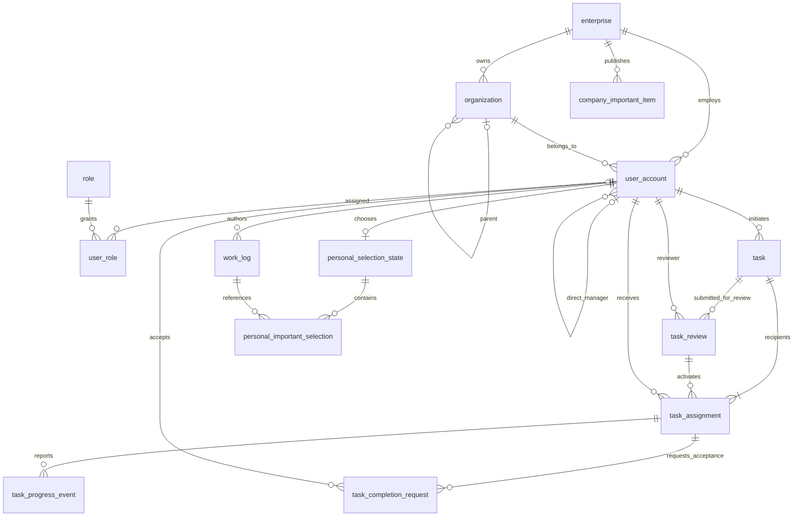

# Pandora 数据库设计

版本：DB0.1 / 2026-10-09。状态：**概念与逻辑设计草案，未执行任何建库、建表、SQL 或迁移**。

依据：[第二章需求草案](../requirements/Pandora_第二章_20261009需求修订草案.md)、[需求审查与 Q 清单](../requirements/Pandora_20261009_需求审查记录.md)、[技术架构草案](../architecture/Pandora_技术架构设计_20261009.md)。本文不修改需求原件，不将待确认规则升格为正式数据库约束。

## 1. 选型、原则与设计状态

建议 MySQL 8.4 / InnoDB、utf8mb4；当前仓库仍未接入数据库，选型待团队评审。本稿不提供可直接部署的 DDL，避免未决业务通过 SQL 先行定案。

原则：

1. 任务共享字段、接收人执行、派发审核分别建模；不让多位接收人共用一个 progress。
2. 日志独立记录，不强制关联任务；草稿与已发布数据分开。
3. 日/周/月是同一数据的查询和展示，不创建三套日历任务表。
4. 租户隔离必须同时有查询权限与企业复合引用约束，单一 ID 外键不够防止错误的跨企业关联。
5. 历史审核、进度与验收事实保留；不使用用户删除或任务级联删除清空历史。
6. 字段类型、VARCHAR 长度、默认值、索引和英文状态名都是技术建议，不是甲方已经确定的字数或业务分类。字段容量与接口限制须实现前统一评审。
7. 待确认扩展单列，尤其日志 task_id、服务端草稿、父子关联、整体完成与重审流程。数据库能表达某状态，不意味着系统已允许该操作。

### 1.1 公共字段约定

| 字段 | 候选类型 | 约束/含义 |
| --- | --- | --- |
| id | BIGINT UNSIGNED | 主键，由服务端产生；API 用字符串传输；自增或其他生成方式由团队选择 |
| enterprise_id | BIGINT UNSIGNED | 企业内业务表必填，FK→enterprise.id；enterprise 本身和全局 role 字典除外 |
| created_at | DATETIME(6) | 必填，服务端 UTC 创建记录时间，不接受客户端覆盖 |
| updated_at | DATETIME(6) | 可变实体必填，更新时由服务端写入；追加历史表不需要 |
| version | BIGINT UNSIGNED | 可变实体必填，初始 0；并发更新比较并递增；不是审批轮次 |

下文可变表继承 created_at/updated_at/version；追加历史表继承 created_at；关系表按其章节指定。除 role 外，每个有 id 的企业内表均增加 UNIQUE(enterprise_id, id)，作为显式复合外键目标，避免依赖非唯一索引引用。

企业关联引用统一写法：`FK→user_account` 表示 `(enterprise_id, user_id) → user_account(enterprise_id, id)`，组织/任务/日志同理。复合键与索引须列顺序、类型一致，遵循 [MySQL 8.4 外键约束文档](https://dev.mysql.com/doc/refman/8.4/en/create-table-foreign-keys.html)；本设计不依赖已弃用的非标准非唯一引用。

## 2. 概念 ER 图与基数

下图包含 14 个核心候选实体；“核心候选”表示围绕当前确定能力提出的表，不代表已创建，也不要求一次全部实施。可选父任务关系和草稿扩展不计入此图。

注意：审核人可审核多项任务，一次提交只由发起人的直接上级处理，不表示并行多人会审。task 至少有一名接收人由应用事务保证，ER 图的基数不能自行强制该约束。组织树与人员汇报关系各自无环；直属上级不是单凭所属组织父节点推算。

## 3. 企业、组织与用户

### 3.1 enterprise（企业）

继承可变公共字段，不含 enterprise_id。

| 字段 | 类型 | 空值 | 说明 |
| --- | --- | --- | --- |
| name | VARCHAR(128) | 否 | 企业名称，非全局唯一业务承诺 |
| status | VARCHAR(16) | 否 | 技术候选 ACTIVE / DISABLED；企业停用处理流程另行评审 |

没有预设跨企业人员调动或平台超级管理员业务。初始化企业、首个管理员的技术引导流程须单独审核，不设计公开注册或自动赋予全企业私人数据权限。

### 3.2 organization（组织节点）

继承可变公共字段。

| 字段 | 类型 | 空值 | 说明 |
| --- | --- | --- | --- |
| parent_id | BIGINT UNSIGNED | 是 | 同企业上级节点 FK→organization；根为空 |
| name | VARCHAR(128) | 否 | 名称 |
| kind | VARCHAR(24) | 否 | COMPANY / DEPARTMENT / TEAM 技术编码 |
| status | VARCHAR(16) | 否 | ACTIVE / DISABLED 候选 |

索引：(enterprise_id, parent_id, id)。应用服务在事务中验证节点同企业、合法类型关系、不能自指、不能形成祖先循环；移动节点时同时验证影响的人员管理范围，不能只更新一条 parent_id 而产生非法授权。

先采用邻接表表示树，课程规模可递归查询或服务层计算授权子树；没有确认性能瓶颈前不额外建 closure/path 双数据源。节点停用不物理删除历史引用。

### 3.3 user_account（人员与账号）

继承可变公共字段。

| 字段 | 类型 | 空值 | 说明 |
| --- | --- | --- | --- |
| organization_id | BIGINT UNSIGNED | 否 | 所属组织 FK→organization |
| manager_user_id | BIGINT UNSIGNED | 是 | 直接上级 FK→user_account，最高级可为空，不代表免审 |
| login_name | VARCHAR(64) | 否 | 合法登录名；全局唯一是本稿简化登录的技术建议，企业内唯一是替代方案 |
| password_hash | VARCHAR(255) | 否 | 单向密码哈希，仅认证内部访问，绝不返回客户端 |
| display_name | VARCHAR(64) | 否 | 姓名 |
| position_name | VARCHAR(128) | 是 | 职位，个人基础信息展示 |
| status | VARCHAR(16) | 否 | ACTIVE / DISABLED 候选 |

候选 UNIQUE(login_name)；大小写/标准化和唯一范围须认证设计评审，若改为企业内唯一则同时明确登录时企业定位方式，不能只改索引不改认证契约。索引：(enterprise_id, organization_id, status, id)、(enterprise_id, manager_user_id, id)。人员上级不能指向本人、跨企业或形成环；上下级与组织配置须一致。管理员角色不是 manager_user_id 的自动特殊值。

### 3.4 role（受控角色字典）

全局技术目录：id、code VARCHAR(32) UNIQUE、name VARCHAR(64)、created_at；不承载企业业务正文。候选 code：SYSTEM_ADMIN、FOUNDER、DEPARTMENT_MANAGER、TEAM_LEADER、EMPLOYEE。

权限代码在后端集中目录/策略层维护，而非散落在 Compose 或 Controller。P0 需求是分配业务角色，没有明确开放任意权限编辑器，因此本稿不新增权限 CRUD 和任意审批配置表；如后续需要动态维护权限，再按 OpenSpec 增加 permission / role_permission。

### 3.5 user_role（账号角色关系）

| 字段 | 类型 | 空值 | 说明 |
| --- | --- | --- | --- |
| enterprise_id | BIGINT UNSIGNED | 否 | FK→enterprise |
| user_id | BIGINT UNSIGNED | 否 | 同企业 FK→user_account |
| role_id | BIGINT UNSIGNED | 否 | FK→role.id，全局受控字典 |
| created_at | DATETIME(6) | 否 | 服务端分配时间 |

PK(enterprise_id, user_id, role_id)。此结构容纳角色映射，不自动确认用户必须有多重角色；角色冲突和允许数量由需求评审决定。管理员赋权后服务端更新权限上下文，不能让旧客户端角色缓存继续授权。

## 4. 任务、审核、执行与验收

### 4.1 task（共享任务信息）

继承可变公共字段。

| 字段 | 类型 | 空值 | 说明 |
| --- | --- | --- | --- |
| creator_user_id | BIGINT UNSIGNED | 否 | 发起人 FK→user_account，不允许请求任意替换 |
| title | VARCHAR(256) | 否 | 非空任务名称，长度为容量建议 |
| description | TEXT | 否 | 任务说明/备注；是否允许空备注需按最终输入校验确定 |
| priority_level | TINYINT UNSIGNED | 否 | 1～5；高低含义和排序 Q-08 待确认 |
| start_date | DATE | 否 | 开始业务日期 |
| end_date | DATE | 否 | 截止业务日期 |
| time_kind | VARCHAR(16) | 否 | DATE_ONLY / TIMED 技术编码 |
| start_time | TIME | 是 | 定时任务具体时刻，精确到分钟；不是持续时长 |
| end_time | TIME | 是 | 与 start_time 成对 |
| approval_status | VARCHAR(16) | 否 | PENDING / APPROVED / REJECTED 技术状态 |
| content_revision | INT UNSIGNED | 否 | 提交内容修订序号，技术初始 1；区别于每次更新的 version |

没有共享 progress，也没有个人接收人列表字符串字段。父任务字段和整体完成状态见第 8 节，不混进无条件核心字段。

候选行内约束：priority_level 在 1～5；end_date≥start_date；DATE_ONLY 两个 time 为空；TIMED 两个 time 均非空且只接受合法小时分钟。定时同日起止先后由应用按 Q-07 决策校验，是否同刻/端点包含/跨日解释不得偷偷变成默认 SQL 规则。

索引：(enterprise_id, creator_user_id, created_at, id)、(enterprise_id, approval_status, start_date, id)、(enterprise_id, approval_status, end_date, id)。区间重叠查询仍需比较另一端点，两个 B-tree 索引不保证同时高效消除所有扫描；真实 Explain 与数据规模评测后调整。

### 4.2 task_review（派发审核事实与批准内容）

继承 created_at，另含 version（用于一次处理并发，不允许覆盖已完成审核事实）。

| 字段 | 类型 | 空值 | 说明 |
| --- | --- | --- | --- |
| task_id | BIGINT UNSIGNED | 否 | FK→task |
| round_no | INT UNSIGNED | 否 | 技术初始 1；多轮原任务重提仅在 Q-04 通过后启用 |
| submitted_revision | INT UNSIGNED | 否 | 本次审核的 task.content_revision |
| applicant_user_id | BIGINT UNSIGNED | 否 | FK→user_account，必须等于任务发起人 |
| reviewer_user_id | BIGINT UNSIGNED | 否 | 同企业直接上级 FK→user_account；无上级时不伪造 ID 或自行免审 |
| status | VARCHAR(16) | 否 | PENDING / APPROVED / REJECTED |
| submitted_at | DATETIME(6) | 否 | UTC 提交时间 |
| decided_at | DATETIME(6) | 是 | 未处理为空；处理后必填 |
| content_snapshot | JSON | 否 | 经服务端生成的任务内容、时间、接收人 ID 快照；不是客户端随意 JSON |
| decision_note | TEXT | 是 | 批注候选；驳回批注业务按 Q-04 定案，不擅自要求必填 |

UNIQUE(enterprise_id, task_id, round_no)、UNIQUE(enterprise_id, task_id, id)，后者供 assignment 复合引用。索引：(enterprise_id, reviewer_user_id, status, submitted_at, id)。处理时校验任务当前修订与快照一致；已经处理的审核不可改写，重复调用返回已处理或版本冲突。

快照保留历史批准内容，不能用它替代用户/任务的规范外键和当前权限。任务批准后任何修改允许范围须服务层按 FR-TASK-12 判断；不可静默修改接收人使历史审批失去意义。审核人变更时保持历史事实，待审如何转交需业务补充，不自动重指定审核人。

### 4.3 task_assignment（每位接收人的任务关系）

继承可变公共字段。

| 字段 | 类型 | 空值 | 说明 |
| --- | --- | --- | --- |
| task_id | BIGINT UNSIGNED | 否 | FK→task |
| review_id | BIGINT UNSIGNED | 否 | (enterprise_id, task_id, review_id)→task_review(enterprise_id, task_id, id)，不得引用别的任务审核 |
| assignee_user_id | BIGINT UNSIGNED | 否 | FK→user_account，一人一关系 |
| status | VARCHAR(32) | 否 | PENDING_APPROVAL / ACTIVE / AWAITING_ACCEPTANCE / ACCEPTED |
| progress | TINYINT UNSIGNED | 否 | 0～100，技术初始 0；100不自动验收 |
| activated_at | DATETIME(6) | 是 | 审核通过后正式生效时间 |
| accepted_at | DATETIME(6) | 是 | 发起人验收通过时间；非验收状态为空 |

UNIQUE(enterprise_id, task_id, assignee_user_id) 防重复接收关系。索引：(enterprise_id, assignee_user_id, status, task_id)、(enterprise_id, task_id, status, id)。CHECK progress BETWEEN 0 AND 100；ACCEPTED 与 accepted_at 一致，未激活状态不能伪造 activated_at。审核未通过的关系维持未生效，不解释为正式员工任务。

审核状态与接收状态是不同事实；一致性靠同一事务和服务层校验，不企图在单行 CHECK 中跨表查审核结果。原任务重审会怎样保留/替换接收关系由 Q-04 决定，当前唯一约束不能被解释成允许绕开审批任意变更接收人。

### 4.4 task_progress_event（接收人进度记录）

继承 created_at，只追加。

| 字段 | 类型 | 空值 | 说明 |
| --- | --- | --- | --- |
| assignment_id | BIGINT UNSIGNED | 否 | FK→task_assignment |
| actor_user_id | BIGINT UNSIGNED | 否 | FK→user_account，必须是该接收人 |
| progress | TINYINT UNSIGNED | 否 | 本次结果 0～100 |
| note | TEXT | 是 | 进度说明，可独立于日志；最终最大长度须与接口一致 |
| assignment_version_after | BIGINT UNSIGNED | 否 | 更新后的接收关系版本，用于防重复事件与追踪 |

UNIQUE(enterprise_id, assignment_id, assignment_version_after)；索引：(enterprise_id, assignment_id, created_at, id)。最新进度在 assignment，事件用于说明与变更追踪；两者同一事务更新。不为每个百分比建立新的正式任务，不把 note 视为工作日志。

### 4.5 task_completion_request（接收人的完成申请与验收）

继承 created_at/version。

| 字段 | 类型 | 空值 | 说明 |
| --- | --- | --- | --- |
| assignment_id | BIGINT UNSIGNED | 否 | FK→task_assignment |
| requester_user_id | BIGINT UNSIGNED | 否 | FK→user_account，必须等于接收人 |
| requested_at | DATETIME(6) | 否 | 服务端申请时间 |
| status | VARCHAR(16) | 否 | 核心候选 PENDING / ACCEPTED；验收不通过后的细节另行明确 |
| reviewer_user_id | BIGINT UNSIGNED | 是 | 处理前为空；验收人为 task.creator_user_id，FK→user_account |
| reviewed_at | DATETIME(6) | 是 | 验收时间 |
| review_note | TEXT | 是 | 验收说明技术预留，不新增必须填写业务要求 |

索引：(enterprise_id, assignment_id, status, id)。同一接收关系待验收/已验收时不得重复申请（US13）；锁住 assignment 后查既有请求再创建，不能依靠普通“先查询再插入”抵御竞态，也不能伪造 MySQL 部分唯一索引语法。

接受申请时 task_completion_request.reviewed_at 与 assignment.accepted_at 写同一服务端时间；进度、完成申请与验收分别记录。某一接收人验收不更改别人的记录。完成后不开启重新执行；整体任务人工完成方式和验收不通过的处置需业务细化后扩展，不能用级联更新自作决定。

## 5. 工作日志与公司事项

### 5.1 work_log（已发布工作日志）

继承可变公共字段，仅保存正式已发布内容。

| 字段 | 类型 | 空值 | 说明 |
| --- | --- | --- | --- |
| author_user_id | BIGINT UNSIGNED | 否 | FK→user_account，服务端取当前用户 |
| work_date | DATE | 否 | 工作所属自然日；不强行等于服务器 UTC 日期 |
| content | TEXT | 否 | 完整非空日志正文，不是 AI 摘要 |
| published_at | DATETIME(6) | 否 | 服务端初次发布记录时间；修改日志不重写此时间 |

索引：(enterprise_id, author_user_id, work_date, published_at, id)。**不设 UNIQUE(author_user_id, work_date)**，同一天可多条；不设 task_id、必须任务关系、日志删除或 AI 标注字段。本人修改 content/允许日期字段时校验 version；上级只有已授权读取能力。时间日期修改允许范围须按本人编辑规则细化，不引入日志锁定审批。

published_at 区分初次记录与 updated_at，历史默认排序建议 work_date DESC、published_at DESC、id DESC（最后 ID 只是稳定技术并列次序）。查看具体日期依据 work_date，不用发布时间偷换业务日期。草稿不进入 work_log，因此不能混到下级日报、统计或个人候选。

### 5.2 company_important_item（公司重要事项）

继承可变公共字段。

| 字段 | 类型 | 空值 | 说明 |
| --- | --- | --- | --- |
| publisher_user_id | BIGINT UNSIGNED | 否 | FK→user_account，具备维护/发布权限 |
| title | VARCHAR(256) | 否 | 事项名称 |
| content | TEXT | 是 | 完整说明，字段容量建议 |
| published_at | DATETIME(6) | 否 | 已发布事实时间 |

索引：(enterprise_id, published_at, id)。本表只描述已发布事项，不擅加多级审核或正式事项草稿流程。FR-DASH-08 / US22 的维护权限由后端控制；列表如何选“十大”、置顶排序和修改发布时间策略 Q-12 待确认。本表没有“最多十行”约束。公司派发任务复用 task / assignment，不另建 company_task 副本表。

## 6. 个人重要事项选择

### 6.1 personal_selection_state（本人选择状态与并发保护）

| 字段 | 类型 | 空值 | 说明 |
| --- | --- | --- | --- |
| enterprise_id | BIGINT UNSIGNED | 否 | FK→enterprise |
| owner_user_id | BIGINT UNSIGNED | 否 | 同企业 FK→user_account |
| has_manual_selection | BOOLEAN | 否 | 技术初始 false，区分未设置与明确提交过的集合 |
| version | BIGINT UNSIGNED | 否 | 初始0，替换集合时递增 |
| created_at / updated_at | DATETIME(6) | 否 | UTC 服务端时间 |

PK(enterprise_id, owner_user_id)。它不是又一份个人重要日志，而是为“最多十条”集合替换提供可锁定的单用户保护行；记录不存在时须安全插入/锁定，不能并发各插入十条。has_manual_selection 的边界尤其空选集合与默认全选关系必须 Q-09 确认后启用对应行为。

### 6.2 personal_important_selection（选中日志引用）

| 字段 | 类型 | 空值 | 说明 |
| --- | --- | --- | --- |
| enterprise_id | BIGINT UNSIGNED | 否 | FK→enterprise |
| owner_user_id | BIGINT UNSIGNED | 否 | 与选择状态复合 FK→personal_selection_state |
| log_id | BIGINT UNSIGNED | 否 | 同企业 FK→work_log |
| created_at | DATETIME(6) | 否 | 本次选择记录时间 |

PK(enterprise_id, owner_user_id, log_id)，另有索引(enterprise_id, log_id)。引用完整 work_log，不复制正文、摘要或当天展示排名；展示仍按日志时间倒序，而非按勾选先后排序。

同企业外键不能证明 log.author_user_id=owner_user_id 或日志在最近十日，也不能证明集合≤10。这三个条件须由应用在锁住选择状态后统一校验；读取时也校验作者与当前窗口，避免旧引用越窗泄露。Q-09 未定前，不能自动删旧选中、补新条目或重新全选；有效数据过滤与选择集合自动修改是两件不同事。

业务窗口表示“今天及此前九个自然日”的十日集合，具体今天由确认后的业务时区计算，而非用 `NOW()-240小时`。候选≤10默认全选，>10由本人选择；当>10且尚未选择时返回待选择状态而不是自行挑十条。日志数量按记录条数，同日多条分别计入；个人日志面板只限制可见量，完整列表仍包含全部十日记录。

## 7. 约束、查询与一致性

### 7.1 分层约束清单

| 约束 | 数据库层 | 应用层 |
| --- | --- | --- |
| 同企业引用 | 业务表 enterprise FK + 对用户/组织/任务的复合 FK | 身份企业条件、请求范围校验、禁止跨租户操作 |
| 进度0～100、重要程度1～5 | NOT NULL + CHECK | DTO校验，权限与状态校验 |
| 全天/定时时间完整 | NOT NULL time_kind + 明确 NULL 分支 CHECK | 成对时刻、小时分钟、日期与 Q-07 规则 |
| 直属上级审核 | reviewer/applicant 同企业 FK | 人员汇报关系、审核权限、申请内容版本一致 |
| 审核通过才正式派发 | 合法状态枚举候选 | 同事务更新 task/review/assignment，查询过滤批准与激活 |
| 独立接收人 | 每任务/用户 UNIQUE，关联审核与任务复合 FK | 接收人范围；只更新本人关系 |
| 组织/人员无环 | 自引用 FK、不能自指的简单 CHECK | 递归环路、移动节点及角色/组织一致性 |
| 私人日志与重要选择 | 企业外键、引用唯一、选择保护 PK | 本人/管理范围、十自然日、最多十条、默认规则 |
| 一致完成时间 | 合法状态与时间非空一致 CHECK | 验收事务、发起人验证、不得重复验收或重开 |

MySQL CHECK 遇 NULL 可能得 UNKNOWN，不能用一个简单范围表达式代替必要的 NOT NULL 与明确 NULL 分支；见 [MySQL CHECK 文档](https://dev.mysql.com/doc/refman/8.4/en/create-table-check-constraints.html)。跨行选择总数与跨表审核权限不能假装由单行 CHECK 保证。

FK 默认建议 ON DELETE RESTRICT / ON UPDATE RESTRICT，历史实体不得通过级联删除丢失。账号停用保留引用；日志 MVP 无删除入口。选择集合整体替换可删除旧的**关系行**，不删除被引用的工作日志。数据保留/合规清除期限未确定，不在本稿擅设保留年限。

### 7.2 典型读查询计划（非已实现 SQL）

| 查询 | 范围/条件 | 主要索引或处理 |
| --- | --- | --- |
| 本人正式任务 | 企业 + assignee + 已激活关系 + task审核通过 | assignment 的 assignee/status 索引，JOIN task投影；不读取未通过审核申请 |
| 审核待办 | 企业 + reviewer + PENDING | review 的 reviewer/status/submitted 索引；前端入口未定不改变数据权限 |
| 授权管理者任务 | 企业 + 管理范围成员 + 合法任务参与/关联权 | 组织/汇报关系范围集合，assignment过滤；不先查全企业再客户端筛 |
| 日周月任务 | 已授权任务 + 日期范围重叠 | task起止候选索引与 assignment 归属索引；同一 taskId 去重 |
| 本人日志历史/日期 | 企业 + 作者 + work_date条件 | log日期/发布时间索引，稳定分页 |
| 下级日志 | 企业 + 已授权成员集合 + work_date | 同日志索引；不读私人草稿 |
| 个人重要事项 | 本人十日候选 + 已有引用 | log索引、selection复合主键；展示完整日志当前正文 |
| 公司事项 | 企业 + 发布列表 | company_item发布时间索引；十大规则待确认 |
| 本人基础统计 | 本人的正式 assignment 和 accepted事实 | ACCEPTED 才算本人验收完成；分母/整体口径 Q-12 确认后固化 |

日历同任务跨多日不增加记录；分页可见条数不等于数据库数据上限。月任务数量很大时按合法日期分段读取或提供逐级路径，不能随意截断任务却不报数量。全文搜索、分类过滤和重复任务没有确认需求，不新增相关索引或表。

### 7.3 写事务与并发策略

1. 提交派发：验证全部接收人 → 保存 task → task_review 内容快照 → 插入待生效 assignments → 一起提交；任一失败全部回滚。
2. 审核：锁 task/review → 校验待审、直接上级、revision → 记录决定 → 通过时激活全部对应接收关系；事务完成后才进入正式查询。
3. 进度：锁/版本比较指定 assignment → 校验当前接收人 → 更新 progress → 同事务追加 event。不得将甲的进度写到 task 或乙的记录。
4. 完成：锁 assignment → 确认 ACTIVE 且无待验收/已验收 → 插入 request → 状态置 AWAITING_ACCEPTANCE。US13 禁止待验收和已验收重复提交。
5. 验收：锁 assignment/request → 校验发起人和待处理 → 用同一服务端时间记录 ACCEPTED / accepted_at；其他接收关系保持不变。
6. 日志编辑：比较 version；失败提示冲突，不覆盖新正文。发布、改动后读取引用展示最新完整日志，不通过复制一份摘要做同步。
7. 个人选择：锁 selection_state（含首次创建竞争）→ 统一验证 owner/window/count/distinct → 删除旧选择关系并插入全部新引用 → 更新 state/version → 提交。非法集合全部拒绝，不截成十条默默保存。

重复审核/验收的业务状态校验与唯一约束构成基础幂等。发布日志的网络重试幂等方式可另评审客户端命令 ID / 服务端请求去重记录，不能用“同作者同日期唯一”达到去重而违反同日多日志。

## 8. 暂缓纳入的候选结构

| 候选 | 需要确认 | 确认前处理 |
| --- | --- | --- |
| task.parent_task_id（可空自引用） | Q-11 / US39；关联读取范围 | 仅概念预留；同企业、无环、有权访问且具创建权后才关联，不改变父任务完成 |
| task.overall_status / overall_completed_at | Q-12，负责人如何判断并触发整体完成 | 不自动从所有 assignment 或子任务生成；明确流程后增加字段与验收 |
| task_review 多 round + 原任务修订历史 | Q-04 / FR-TASK-17 | round_no只用1；保存单次审核事实可行，原任务重提按钮/多轮替换另确认 |
| work_log_draft | Q-10，长期/跨设备/期限 | 客户端草稿行为可先设计；不将未发布正文混入work_log；服务端表暂缓 |
| task_draft | Q-06，正式状态/可见/提交方式 | 原型表单草稿不升级正式 DRAFT 状态，不进入正式任务查询 |
| log_task_relation | Q-05，可选关联 | 无强制task_id；确认后可空引用/关系方案再评审，不借验收参考日志建立强绑定 |
| notification / outbox | P1 FR-NOTIFY-01，投递范围/可靠性 | 不为本轮自动增加MQ或邮件服务；核心事务不调用外部网络 |
| work_request / AI记录 | P1/P2 | 不引入业务新表；后续独立规格、权限和隐私评审 |
| 持久会话/安全审计 | 技术安全设计及部署策略 | 独立安全评审后选实现；不编造凭据或把token放业务表正文 |

这些候选不是“取消功能”。例如上级任务关联在当前草案有描述，但追踪表待确认，因此留有设计位置而未定稿为核心 DDL。

## 9. 需求追踪、验证与落地门槛

| 需求 | 对应实体 | 设计验证目标 |
| --- | --- | --- |
| FR-USER-01～08 | enterprise/organization/user_account/role/user_role | 同企业外键、上下级无环、角色不代替数据范围 |
| FR-TASK-01～05/10～13 | task/task_review/task_assignment | 申请、批准内容、跨级/多人接收与正式可见性 |
| FR-TASK-06～09/14/15 | assignment/progress_event/completion_request | 进度、申请、验收分离，各接收人互不覆盖 |
| FR-TASK-16/17 | 第8节候选关联/重审 | 确认后再启用，不自动完成父任务 |
| FR-LOG-01～04/06～08 | work_log；草稿第8节 | 同日多条、作者权限、修改冲突、草稿不泄露 |
| FR-LOG-05（取消强制） | 无核心日志任务关联表 | 不因任务验收需参考日志而强制绑定 |
| FR-DASH-01～08 | company_item、正式task、work_log、selection两表 | 十日与十条区分、完整正文、本人引用集合≤10 |
| FR-VIEW-01～09 | 同一task/assignment，不建视图任务实体 | 日视图无日志，连续条形仅投影，月份完整且不丢计划 |
| FR-STAT-01/02 | assignment/task合法状态 | 口径确认后统计；未通过申请不误算为已派发任务 |

后续实施前必须完成：

- 需求审查 Q-03/Q-04/Q-07/Q-09/Q-12 等核心决策；确定数据库与持久化框架；业务 change 与非作者审阅。
- 生成版本化迁移，明确所有复合 FK 的显式唯一目标和引用索引；循环引用（组织/人员自关联）按可空上级后补关系策略建立，不关外键偷导入。
- 在真实选定 MySQL 版本测试约束、事务回滚、隔离和并发；不能用内存集合测试代替真实 DB 证明。
- 测试：跨企业FK失败、日志同日多条成功、普通员工创建拒绝、无权审核拒绝、双审核不重复激活、甲乙进度隔离、双完成申请防重、完成时间一致、两个并发选择集合仍≤10、同刻/跨日/月底边界。
- 依据 NFR-PERF-01/02 固定课程测试环境，执行 Explain / 查询和端到端性能采样；本稿没有声称已达到1秒/2秒指标。
- 迁移、备份恢复、索引性能和数据保留规则经评审后落地；不在LoFi直接改正式业务库。

本次完成的是可讨论的数据库设计基础，不是最终 SQL schema；当前 14 个核心候选实体加隔离扩展为后续确认提供结构，不表示未经甲方/团队确认的规则可以直接上线。
